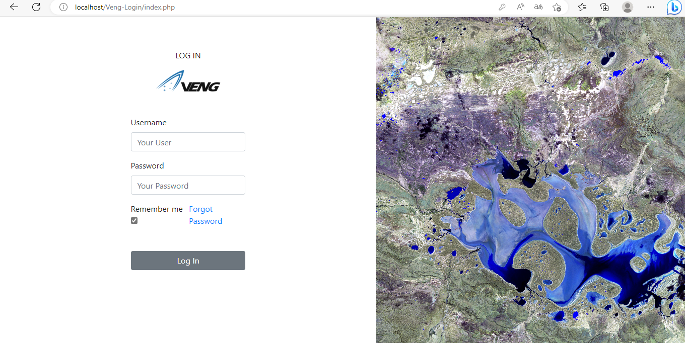
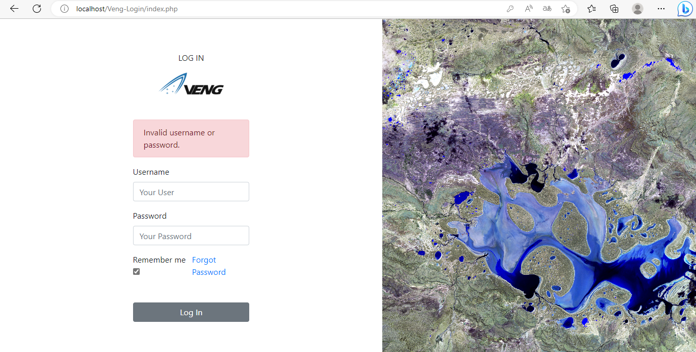
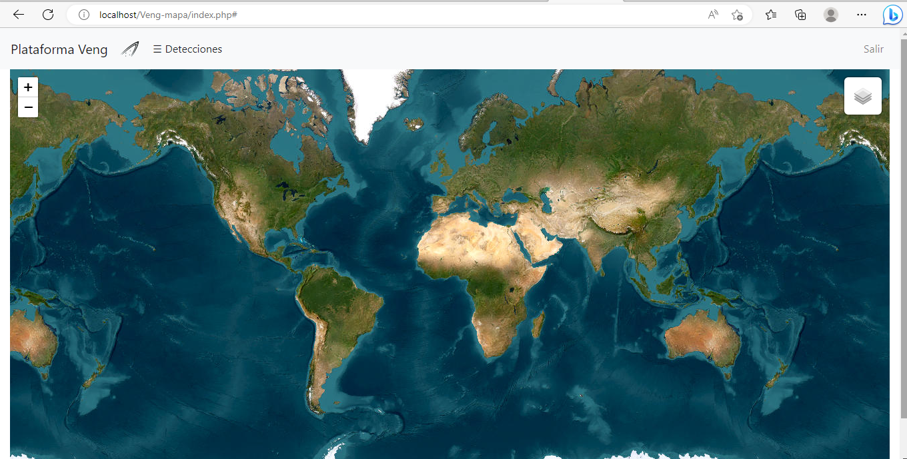
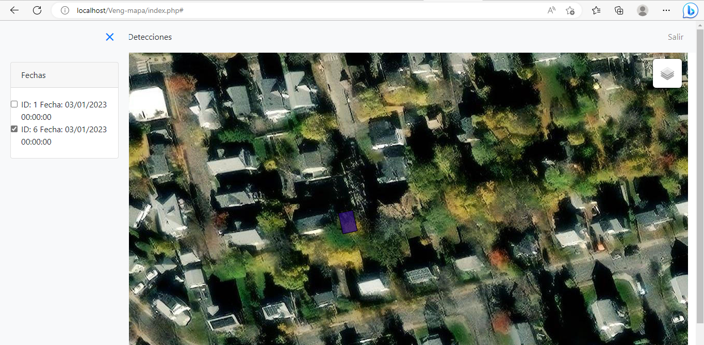
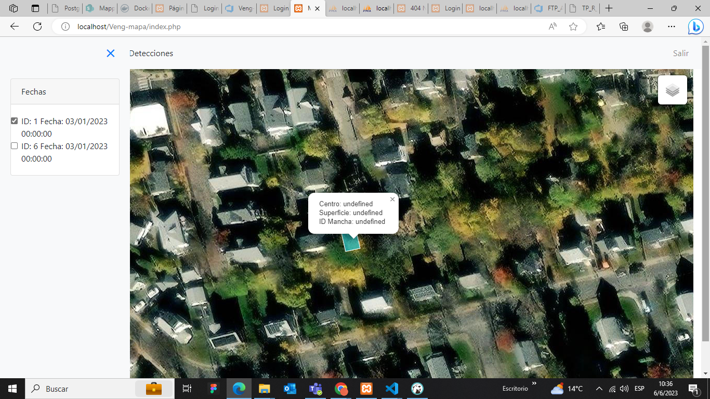

## Reporte Técnico: Plataforma Veng V.1

- Fecha: [7/6/23]

**Resumen**

_Repositorios:_ 

- Veng_Mapa: Describe la estructura y funcionalidades de la plataforma Veng, una aplicación web que muestra un mapa interactivo con detecciones geográficas._ Además, se proporciona información adicional sobre los archivos get_dates.php y get_polygons.php, que se utilizan para obtener datos específicos de detecciones y polígonos a través de llamadas a una API. 

- Veng_Login: Documenta la implementación de un formulario de inicio de sesión utilizando Bootstrap 4.3.1 y PHP. El objetivo es diseñar un login con funcionalidades adicionales como regeneración de ID de sesión, control de tiempo de inactividad, bloqueo después de varios intentos fallidos y almacenamiento seguro de contraseñas mediante hash.

**Referencias**

- Bootstrap Documentation: https://getbootstrap.com/docs/4.3.1/
- PHP Manual: https://www.php.net/manual/en/index.php
- MySQL Documentation: https://dev.mysql.com/doc/
- XAMPP: https://www.apachefriends.org/es/index.html
- Leaflet:  https://leafletjs.com/

**FRONT**

- Inicio de Sesión: 

- Alerta Login: 

- Plataforma Web:  

- Sidebar con las Fechas de las Detecciones: 

- Deteccion con especificaciones: 

_Nota Importante:_

Este informe técnico asume que se ha realizado la configuración adecuada del entorno de desarrollo, incluyendo la instalación de PHP, un servidor web y la creación de la base de datos correspondiente. Además, se establecieron las tablas necesarias en la base de datos para almacenar los datos de los usuarios y por otro lado las detecciones.

Es importante tener en cuenta que este código es considerado como una implementación básica y se debe adaptar y mejorar según las necesidades y requisitos específicos de cada proyecto.# Plataforma-Geoespacial-v.1
